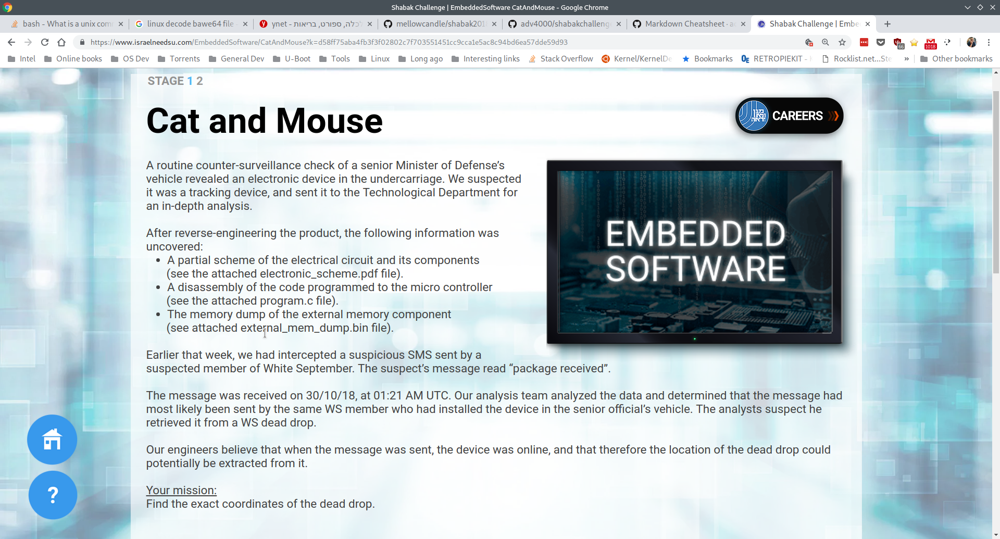
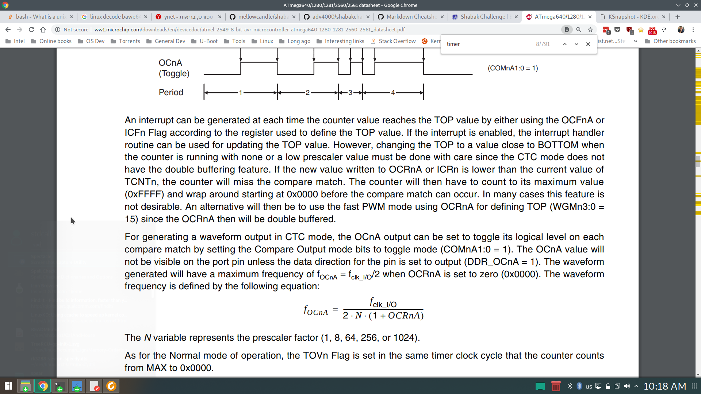

# Challenge 1 - Cat And Mouse

## Synopsis
We are presented with an embedded tracking device and we need to extract an exact location at a specific time.
By looking at the provided electronic scheme, we can see that we have the following components:
* Atmel ATmega2560 - Embedded micro controller. [Datasheet](http://ww1.microchip.com/downloads/en/devicedoc/atmel-2549-8-bit-avr-microcontroller-atmega640-1280-1281-2560-2561_datasheet.pdf)
* u-blox SAM-M8Q - GPS reciever - UART output (NMEA)
* ADXL345 - Accelerometer, I2C output with interrupt line
* Macronix MX66L1G45G - SPI serial NOR flash

## Solution

By examining the provided code we can understand the following characteristics of the tracking device:
* On startup it configures all the peripherals
* It configures a timer interrupt that reoccurrs in every ?? (Need to figure out that)
* It waits for a specific GPS NMEA message (GPRMC), parses it, extracts the current date & time and save it to the flash.
* Whenever suitable, it reads GPS NMEA message (GPGGA) and write the coordinates to the flash.
* An accelerometer interrupt is used to change between states, probably the accelerometer triggers interrupt on activity and inactivity.
* Messages are saved to flash in TLV (Tag, Length, Value) encoding.

My first step was to write a reader that reads the saved flash, basically just go over the entire file and print the data.
After doing that, I was able to extract the coordinates, but I couldn't tell when each was taken.

I needed to know how often the timer interrupt occurs.
Searching for the datasheet for the Atmel ATmega2560 and reading about the timer interrupt I was able to understand how
the timer period is calculated:

All the formula parameters are extracted from *program.c* source code.

I calculated the timer frequency to be 4 sec, this means, that the function interrupt functions is
called once every 4 sec.
In the function it self, it increments a counter and if it's equal to *counter_max_val* it sets *is_triggered* to true.
*counter_max_val* can be set to either 75 (in startup) 15 or 150.
This means that *is_triggered* will be set to true once in every 5 minutes, 1 minute or or 10 minutes.

Whenever there's an accelerometer event that changes *counter_max_val*, it saves that event to the flash.
So basically, if we know the start time, and the current state, we can track the time where each GPS measurement was taken.

The C program [main.c](./main.c) implements a state machine that changes state while printing out the coordinates & time.
You can run it, and if you care for the answer grep the output so it only prints the time "01:21"

*Latitude: 32.21893, Longitude: 35.23226 Tue Oct 30 01:21:00 2018*

That's it, enter the latitude and longitude coordinates and you can start the next challenge.

## References
* You can read more on timer interrupts [here](http://maxembedded.com/2011/06/avr-timers-timer0/)
* [NMEA messages format](https://www.gpsinformation.org/dale/nmea.htm)

