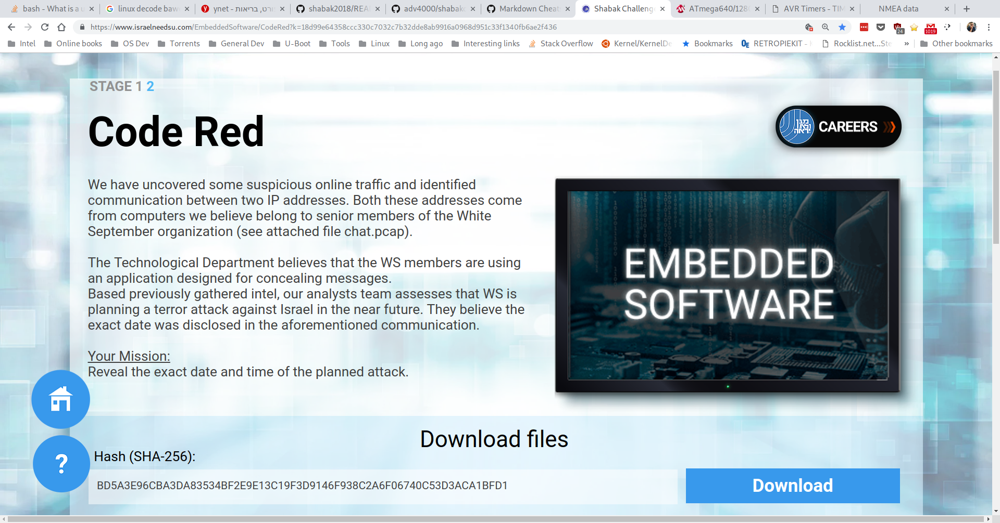
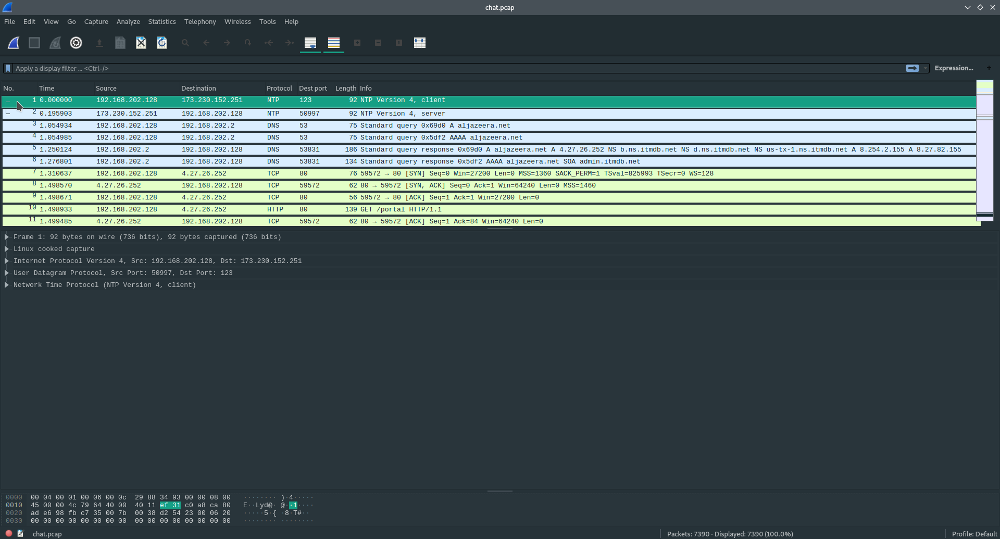
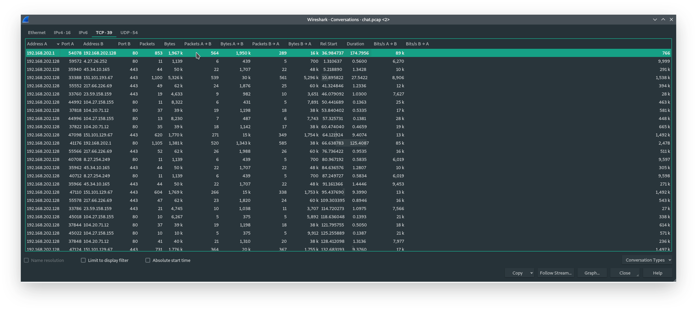

# Challenge 2 - Code red

## Important note
Surprisingly, this is not an embedded SW challenge, it involves network surveillance and cryptography, what usually called today as __Cyber__.

## Synopsis
We are presented with a *chat.pcap* file which is standard packet capture format used by Wireshark, tcpdump etc.
We need to find a conversation between to endpoints and extract date & time for it.

## Solution

First we need to find the IP addresses of the two parties and extract the packets sent by them.
There's a lot of "noise" in the *chat.pcap* file, so first, I had to remove every packet that is irrelevant.
By using Wireshark, we can use the conversations window under Statics menu, to see all the IP that communicated back and forth.

 
