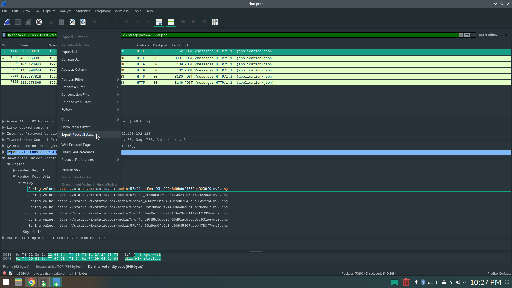

# Challenge 2 - Code red


## Important note
Surprisingly, this is not an embedded SW challenge, it involves network surveillance and cryptography, what usually called today as __Cyber__.

## Synopsis
We are presented with a *chat.pcap* file which is standard packet capture format used by Wireshark, tcpdump etc.
We need to find a conversation between to endpoints and extract date & time for it.


## Solution

First we need to find the IP addresses of the two parties and extract the packets sent by them.
There's a lot of "noise" in the *chat.pcap* file, so first, I had to remove every packet that is irrelevant.
By using Wireshark, we can use the conversations window under Statics menu, to see all the IP that communicated back and forth.


At first, I disqualified  the 192.168.202.1 <--> 192.168.202.128 conversation as it was on private network, and I assumed that the conversation
will be between networks. Being on the same network means that the two members of WS are on the same LAN, doesn't make sense.
After I disqualified all the other conversations I came back to the first one and actually looked at the packets.

The conversation involves HTTP POST communication with JSON payload.
First packet is a list of png images stored on some web-site. I exported the message bytes and downloaded all the images.


```console
wget https://static.wixstatic.com/media/57cf4c_afea1f0bb82348d9bdc24653ea3208f9~mv2.png
wget https://static.wixstatic.com/media/57cf4c_9fa5cba479a24e73a24fb52163d9209b~mv2.png
wget https://static.wixstatic.com/media/57cf4c_4080f95bf84349e5887042c3a06f7114~mv2.png
wget https://static.wixstatic.com/media/57cf4c_0bf3bbad5f74409bad0a3a10b1dbd537~mv2.png
wget https://static.wixstatic.com/media/57cf4c_0aa6e7ffcc024f7ba2b6611f72f2432d~mv2.png
wget https://static.wixstatic.com/media/57cf4c_d9f88c5ddc93488d91ac03c56cc901ae~mv2.png
wget https://static.wixstatic.com/media/57cf4c_56a9ed0fd9c84c98935307aebb4783f7~mv2.png
```

The images downloaded looks like stock images, and by googling photo search it was confirmed.

Rest of the conversations, are just base64 encoded PNG images, I exported all the images, decoded them using 64decode tool.

```console
base64 -d packet2.raw > packet2.png
..
..
base64 -d packet10.raw > packet10.png
```

Looking at the new images I just decoded I saw that they look exactly like the images I downloaded before.
This is to the naked eye of course, image compare to the rescue. (I used Beyond Compare, but there's other tools as well)


Yes, something is different, on the *R* band in *RGB*, there are a series pixels that have changed.
I writing a Python program to extract those bytes, to see what I can figure out of them.

...Nothing.

I sat on these bytes for about two days, looking on them, googling them, until I figured that I might try to XOR them with the original.

I was luck, I managed to get a meaningful sentence:

*Ahlan, how are you?*

Tried doing so to the other images, and I got gibberish.
After tons of manipulation I finally found the trick, each sentence was also XOR'ed with the message ID, starting from 0.
That's why the first message was decoded successfully, as XORing with 0 doesn't change anything.

After that, I managed to read all the messages, piece of cake.

Complete conversation is:

*Ahlan, how are you?*

*Ahlan habibi, I'm fine.*

*How are you?*

*Allahumdulillah! How are all the brothers?*

*They are all excited for new year's eve.*

*We are all very proud of you.*

*We want the party to start at 20:10 exactly.*

*Inshallah, hopefully a lot of people will come.*

*Inshallah, Allahu Akbar.*


So, the bombing should take place on December 31, 20:10

## References
* Python application to extract the bytes, xor, and print the results. [here](script.py)

